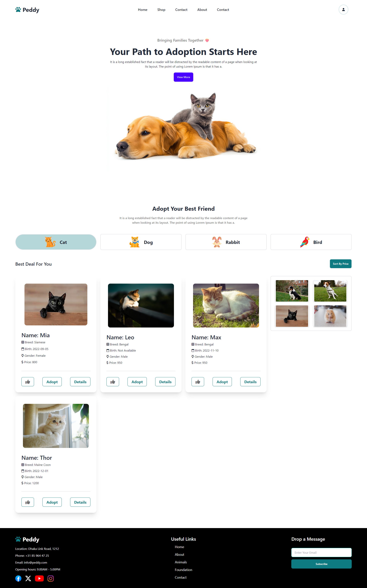

# Pet Adoption Web Application

## Project Overview

This project is a responsive web application designed to showcase pets available for adoption. Built using **HTML5**, **Tailwind CSS**, and **modern JavaScript** features, the app dynamically fetches data from an API, allowing users to browse, like, adopt, and view details about various pets.

## Features

- **Dynamic Data Rendering**: Fetch data from an API and display it dynamically on the UI.
- **Category-Based Filtering**: Filter and display pets by category, allowing users to explore specific types of pets.
- **Interactive Card Design**:
  - **Like Button**: Add pets to a personal gallery.
  - **Adopt Button**: Shows a success modal upon adoption, which disappears after 3 seconds, and disables the button.
  - **Details Button**: Opens a modal with detailed information about the selected pet.
- **Sorting by Price**: Sort pets by price when the sort button is clicked.
- **Responsive Design**: Fully responsive layout that adapts seamlessly to different devices and screen sizes.
- **Minimalistic UI**: A clean, modern interface using **Font Awesome** icons and a minimal color palette for a professional look.

## Technologies Used

- **HTML5**: Markup for structuring the web application.
- **Tailwind CSS**: Utility-first CSS framework for fast UI styling.
- **JavaScript**: Modern ES6+ features for dynamic content and interactions.
- **Font Awesome**: Icons for a visually appealing user interface.

## 👉 Live Demo: [Paddy Adoption](https://paddy-addoption.netlify.app/)

## Screenshots of the Project 🖼️

  

